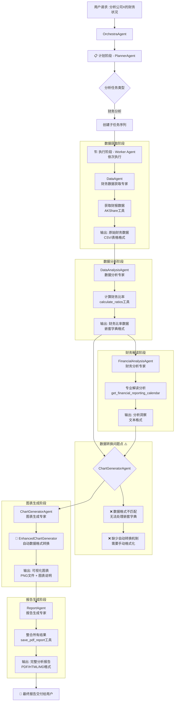
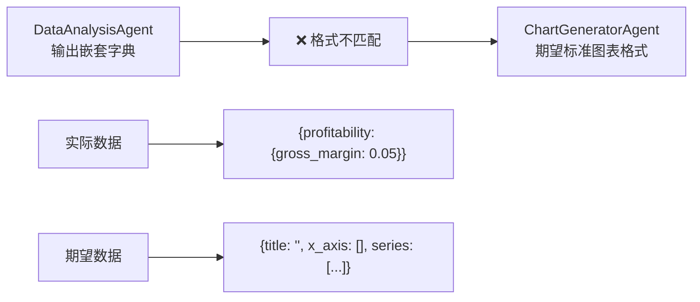
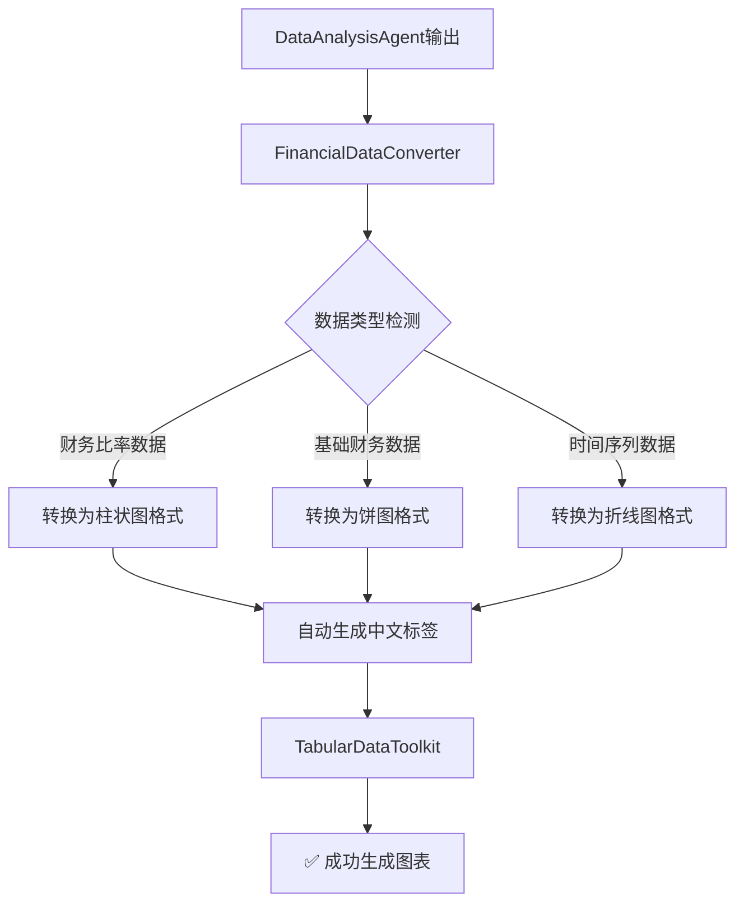

# 🔄 UTU框架智能体数据转换流程完整分析

## 📊 智能体工作流程图



## 🔄 智能体间上下文传递机制详解

### 核心传递模板
```python
# 文件: utu/agents/orchestra/worker.py:18-29
TEMPLATE = r"""Original Problem:
{problem}

Plan:
{plan}

Previous Trajectory:
{trajectory}

Current Task:
{task}
"""
```

### 数据传递流程
```python
# 文件: utu/agents/orchestra/worker.py:39-47
def _format_task(self, task_recorder: OrchestraTaskRecorder, subtask: Subtask) -> str:
    str_plan = task_recorder.get_plan_str()      # 完整计划字符串
    str_traj = task_recorder.get_trajectory_str() # 历史执行轨迹字符串
    return TEMPLATE.format(
        problem=task_recorder.task,              # 原始用户问题
        plan=str_plan,                           # 所有子任务列表
        trajectory=str_traj,                     # 前面所有智能体的输出
        task=subtask.task,                       # 当前要执行的任务
    )
```

### 历史轨迹构建机制
```python
# 文件: utu/agents/orchestra/common.py:83-89
def get_trajectory_str(self) -> str:
    return "\n".join([
        f"<subtask>{t.task}</subtask>\n<output>{r.output}</output>"
        for i, (r, t) in enumerate(zip(self.task_records, self.plan.todo, strict=False), 1)
    ])
```

## 📊 智能体输入输出格式详细分析

### 1. DataAgent (数据获取专家)
**配置文件**: `configs/agents/workers/data_agent.yaml`

**输入格式**:
```python
{
    "problem": "分析陕西建工的财务状况",
    "plan": "1. 获取陕西建工最新财报数据\n2. 计算关键财务比率...",
    "trajectory": "",  # 第一个执行，无历史轨迹
    "task": "使用AKShare工具获取陕西建工的最新财报数据"
}
```

**输出格式**:
```python
{
    "status": "success",
    "data": {
        "income_statement": "陕西建工财务分析_income.csv",
        "balance_sheet": "陕西建工财务分析_balance.csv", 
        "cash_flow": "陕西建工财务分析_cashflow.csv",
        "period": "2024-12-31"
    },
    "raw_output": "已成功获取陕西建工2024年财报数据..."
}
```

### 2. DataAnalysisAgent (数据分析专家)
**配置文件**: `configs/agents/workers/data_analysis_agent.yaml`

**输入格式**:
```python
{
    "problem": "分析陕西建工的财务状况",
    "plan": "1. 获取陕西建工最新财报数据\n2. 计算关键财务比率...",
    "trajectory": "<subtask>获取财报数据</subtask>\n<output>DataAgent的完整输出...</output>",
    "task": "计算陕西建工的关键财务比率指标"
}
```

**输出格式**:
```python
{
    "profitability": {
        "gross_profit_margin": 0.0528,
        "net_profit_margin": 0.0192, 
        "roe": 0.0282,
        "roa": 0.0032
    },
    "solvency": {
        "debt_to_asset_ratio": 0.8871,
        "current_ratio": 1.0,
        "quick_ratio": 1.0
    },
    "efficiency": {
        "asset_turnover": 0.10,
        "inventory_turnover": 0.0,
        "receivables_turnover": 0.0
    },
    "growth": {
        "revenue_growth": 0.0,
        "profit_growth": 0.0
    },
    "warnings": ["资产负债率偏高", "净利润率较低"]
}
```

### 3. FinancialAnalysisAgent (财务分析专家)
**配置文件**: `configs/agents/workers/financial_analysis_agent.yaml`

**输入格式**:
```python
{
    "problem": "分析陕西建工的财务状况",
    "plan": "完整执行计划...",
    "trajectory": "<subtask>获取财报数据</subtask>\n<output>DataAgent输出...</output>\n<subtask>计算财务比率</subtask>\n<output>DataAnalysisAgent输出...</output>",
    "task": "基于财务比率结果进行专业分析和投资建议"
}
```

**输出格式**:
```python
{
    "analysis": "陕西建工的盈利能力相对较弱...",
    "investment_advice": "建议谨慎投资，关注负债率...",
    "risk_factors": ["高负债风险", "盈利能力不足"],
    "opportunities": ["基建投资机会", "区域发展优势"]
}
```

### 4. ChartGeneratorAgent (图表生成专家) ⚠️ 问题关键点
**配置文件**: `configs/agents/workers/chart_generator_agent.yaml`

**输入格式**:
```python
{
    "problem": "分析陕西建工的财务状况",
    "plan": "完整执行计划...",
    "trajectory": "前面所有智能体的完整输出累积...",
    "task": "基于分析结果生成可视化图表"
}
```

**期望输入格式** (传统方式):
```python
{
    "title": "盈利能力指标",
    "x_axis": ["毛利率", "净利率", "ROE", "ROA"],
    "series": [{"name": "指标值", "data": [0.0528, 0.0192, 0.0282, 0.0032]}]
}
```

**实际接收到的数据**:
```python
# DataAnalysisAgent的原始输出
{
    "profitability": {
        "gross_profit_margin": 0.0528,
        "net_profit_margin": 0.0192,
        "roe": 0.0282,
        "roa": 0.0032
    }
}
```

### 5. ReportAgent (报告生成专家)
**配置文件**: `configs/agents/workers/report_agent.yaml`

**输入格式**:
```python
{
    "problem": "分析陕西建工的财务状况", 
    "plan": "完整执行计划...",
    "trajectory": "所有前置智能体的输出累积...",
    "task": "整合所有分析结果生成完整报告"
}
```

**输出格式**:
```python
{
    "report_file": "陕西建工财务分析报告_20241027.pdf",
    "summary": "综合分析显示...",
    "charts": ["chart1.png", "chart2.png", ...],
    "recommendations": [...]
}
```

## 🚨 核心问题详细分析

### 问题1: 数据格式断层


### 问题2: 上下文膨胀
```python
# 执行链条增长时的上下文大小
Agent 1: 1000 tokens (基础输入)
Agent 2: 1000 + 800 = 1800 tokens (+ Agent 1输出)
Agent 3: 1800 + 1200 = 3000 tokens (+ Agent 1+2输出) 
Agent 4: 3000 + 1500 = 4500 tokens (+ Agent 1+2+3输出)
Agent 5: 4500 + 2000 = 6500 tokens (+ Agent 1+2+3+4输出)
```

### 问题3: 缺乏数据类型标记
```python
# 当前传递方式 (纯文本)
"output": "{'profitability': {'gross_profit_margin': 0.0528, ...}}"

# 缺少结构化标记
# 智能体无法自动识别这是财务比率数据
```

## ✅ 我们的解决方案架构

### EnhancedChartGenerator 解决方案


### 数据转换映射表
```python
# 财务指标映射
METRIC_MAPPING = {
    'gross_profit_margin': '毛利率',
    'net_profit_margin': '净利率', 
    'roe': '净资产收益率(ROE)',
    'roa': '总资产收益率(ROA)',
    'debt_to_asset_ratio': '资产负债率',
    'current_ratio': '流动比率',
    'quick_ratio': '速动比率'
}

# 图表类型映射
CHART_TYPE_MAPPING = {
    'profitability': ['bar', 'radar'],
    'solvency': ['bar', 'pie'], 
    'efficiency': ['bar', 'line'],
    'growth': ['line', 'bar'],
    'comprehensive': ['radar']
}
```

## 📈 性能优化建议

### 1. 智能上下文压缩
```python
def compress_context(trajectory: List[Dict], max_tokens: int = 2000) -> str:
    """智能压缩历史上下文，保留关键信息"""
    # 提取关键数据点
    # 压缩描述性文本
    # 保留结构化数据
```

### 2. 数据类型标记
```python
class StructuredData:
    def __init__(self, data: Dict, data_type: str, metadata: Dict = None):
        self.data = data
        self.data_type = data_type  # "financial_ratios", "chart_data", etc.
        self.metadata = metadata or {}
    
    def to_string(self) -> str:
        return f"<DATA_TYPE={self.data_type}>{json.dumps(self.data)}</DATA_TYPE>"
```

### 3. 渐进式数据传递
```python
# 只传递必要的数据，而非全部历史
class SelectiveContext:
    def get_relevant_context(self, current_task: str, full_history: List) -> str:
        # 根据当前任务选择相关历史信息
        # 减少不必要的上下文传递
```

这个分析为后续的优化提供了清晰的技术路线图。